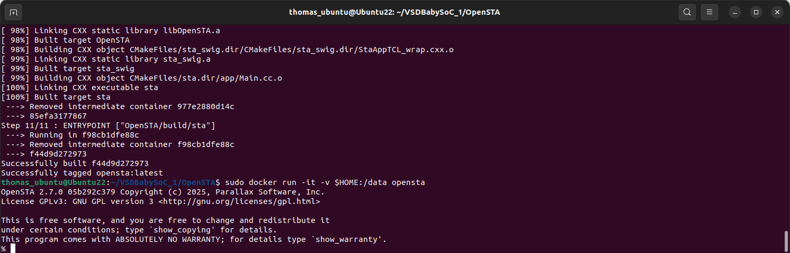
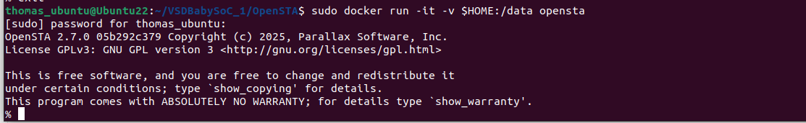
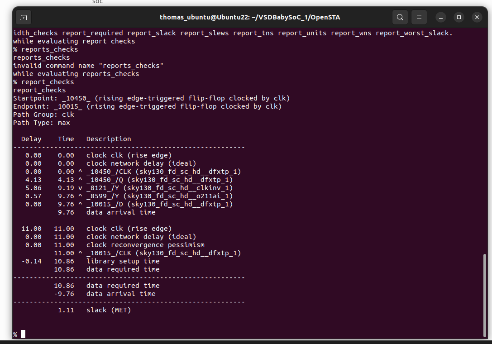

# Static Timing Analysis with OpenSTA
---

### 1. OpenSTA

OpenSTA is a open-source static timing analysis tool.

OpenSTA installed and accessed:

<div align="center"> </div>

---
### 2. Using OpenSTA to do timing analysis
---

#### 1. Accessign OpenSTA:

```
$ sudo docker run -i -v $HOME:/data opensta
```

<div align="center"> </div>

#### 2. Reading the .lib files that are part of the top module:

```
%read_liberty-min sky130_fd sc hd tt 025C 1v80.lib
%read liberty max sky130 fd sc hd tt 025C 1v80.lib
%read_liberty-min avsdpll.lib
%read liberty -max avsdpll.lib
%read_liberty min avsddac.lib
%read_liberty -max avsddac.lib
```

#### 3. Reading the verilog files:

```
%read_verilog vsdbabysoc.synth.v
%link_design vsdbabysoc
```

#### 4. Reading the .sdc files:

```
read_sdc vsdbabysoc_synthesis.sdc
```

#### 5. Generating reports:

```
report_checks
```

<div align="center"> </div>
