# Post Synthesis GLS of BabySoC
---

During GLS of BabySoC, the following are verified:
 
 - Whether the design meets timing requirements.
 - Whether the logical behaviour remains same after realizing the design with standard cells.
 - To see whether the submodules in BabySoC interact with each other properly.

---
## Procedure for post synthesis GLS:
---

### 1. Load the modules into Yosys:

Invoke Yosys and load the modules
```
$yosys
```

```
$read_verilog /home/thomas_ubuntu/VSDBabySoC_1/VSDBabySoC/src/module/vsdbabysoc.v
$read_verilog -I /home/thomas_ubuntu/VSDBabySoC_1/VSDBabySoC/src/include /home/thomas_ubuntu/VSDBabySoC_1/src/module/rvmyth.v
$read_verilog -I /home/thomas_ubuntu/VSDBabySoC_1/VSDBabySoC/src/include /home/thomas_ubuntu/VSDBabySoC_1/src/module/clk_gate.v
```

<div align="center">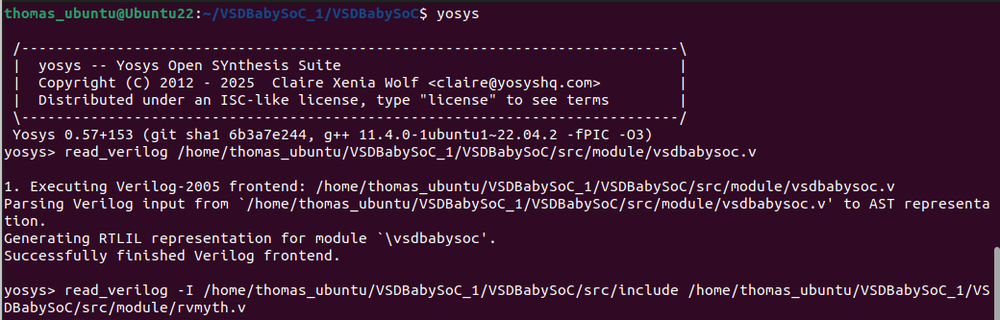 </div>
<div align="center">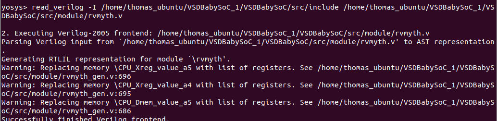 </div>
<div align="center">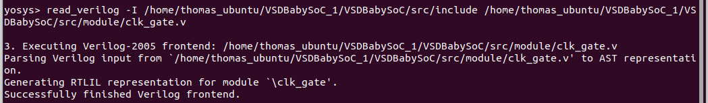 </div>

### 2. Load the Liberty files:

```
$read_liberty -lib /home/thomas_ubuntu/VSDBabySoC_1/VSDBabySoC/src/lib/avsdpll.lib
$read_liberty -lib /home/thomas_ubuntu/VSDBabySoC_1/VSDBabySoC/src/lib/avsddac.lib
$read_liberty -lib /home/thomas_ubuntu/VSDBabySoC_1/VSDBabySoC/src/lib/sky130_fd_sc_hd__tt_025C_1v80.lib
```

<div align="center">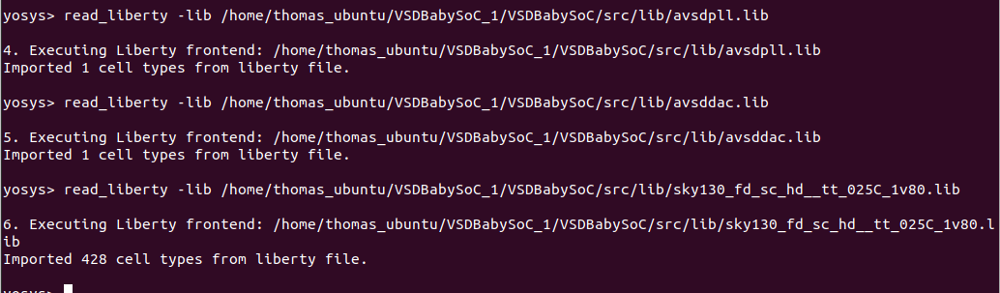 </div>

### 3. Run synthesis:

```
$synth -top vsdbabysoc
```
- The list of standard cells used can be seen as:
<div align="center">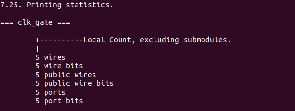 </div>
<div align="center">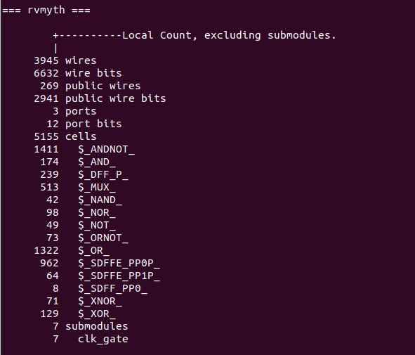 </div>
<div align="center">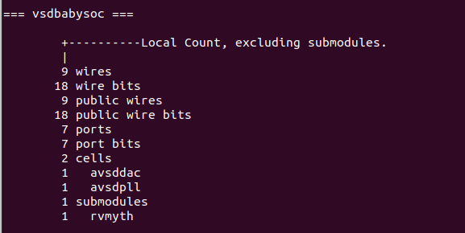 </div>

- The heirarchy of modules:
  <div align="center">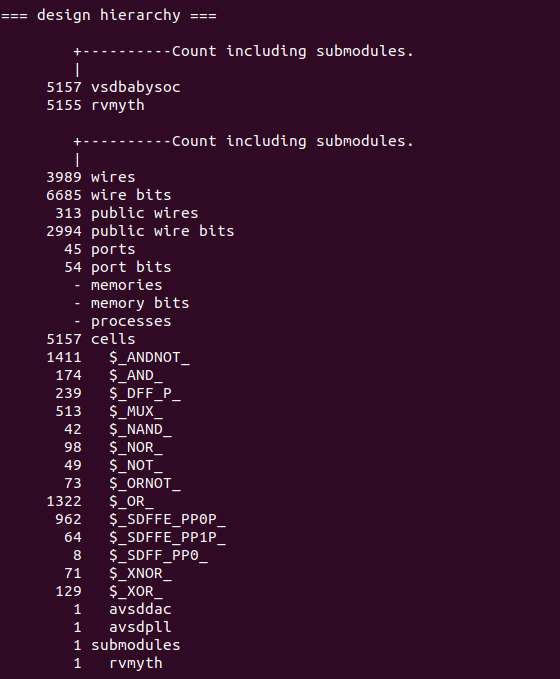 </div>

### 4. Mapping D Flip-Flops to standard cells:

```
$dfflibmap -liberty /home/thomas_ubuntu/VSDBabySoC_1/src/lib/sky130_fd_sc_hd__tt_025C_1v80.lib
```

### 5. Performing optimization and technology mapping:

```
$opt
$abc -liberty /home/thomas_ubuntu/VSDBabySoC_1/VSDBabySoC/src/lib/sky130_fd_sc_hd__tt_025C_1v80.lib -script +strash;scorr;ifraig;retime;{D};strash;dch,-f;map,-M,1,{D}
```

### 6. Perform Final clean-up:

```
$flatten
$setundef -zero
$clean -purge
$rename -enumerate
```
<div align="center">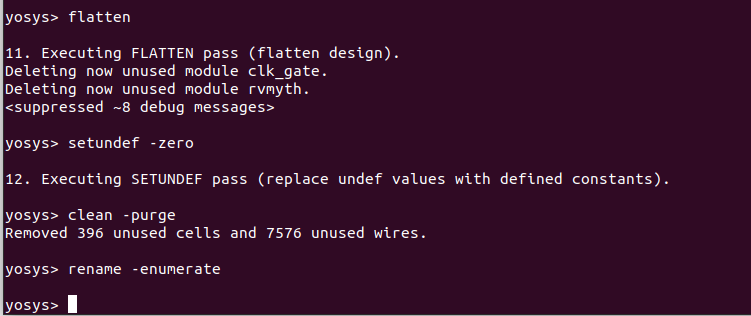 </div>

### 7. Statistics of standard cells:

```
$stat
```
<div align="center">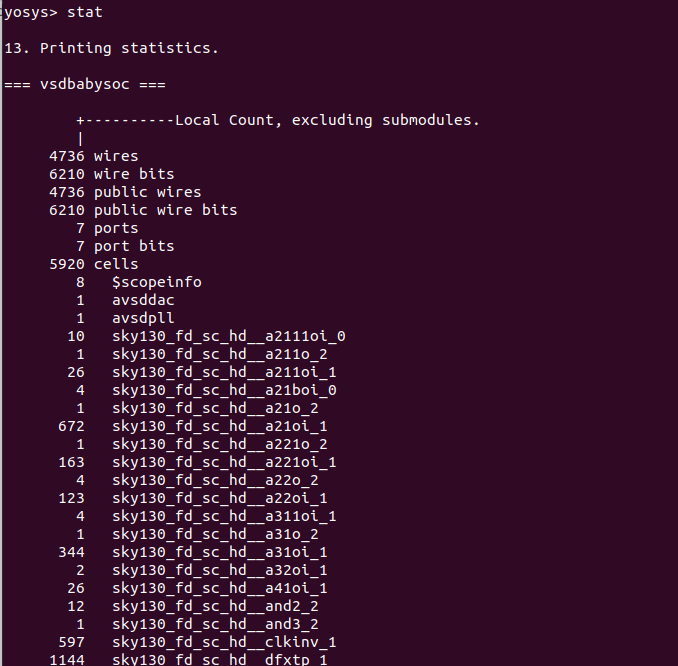 </div>
<div align="center">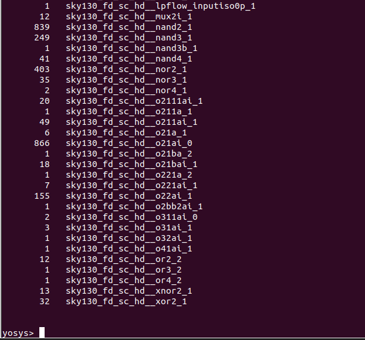 </div>


### 8. Write the synthesised netlist:

```
$write_verilog -noattr /home/thomas_ubuntu/VSDBabySoC_1/VSDBabySoC/output/post_synth_sim/vsdbabysoc.synth.v
```

<div align="center">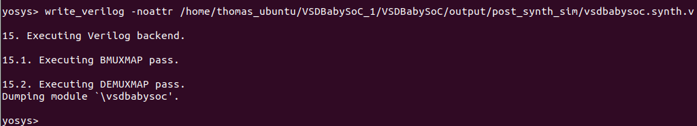 </div>

---
## Post-synthesis simulation using Iverilog and Gtkwave
---

### 1. Compiling testbench using Iverilog:

```
$iverilog -o /home/thomas_ubuntu/VSDBabySoC_1/output/post_synth_sim/post_synth_sim.out -DPOST_SYNTH_SIM -DFUNCTIONAL -DUNIT_DELAY=#1 -I /home/thomas_ubuntu/VSDBabySoC_1/VSDBabySoC/src/include -I /home/thomas_ubuntu/VSDBabySoC_1/VSDBabySoC/src/module /home/thomas_ubuntu/VSDBabySoC_1/VSDBabySoC/src/module/testbench.v
```

Add all the necessary files (```sky130_fd_sc_hd.v```, ```primitives.v```,) to the ```/home/thomas_ubuntu/VSDBabySoC_1/VSDBabySoC/src/module``` directory. Also add the ```vsdbabysoc.synth.v```, which is the netlist generated from Yosys.


### 2. Running the simulation:

```
$cd output/post_synth_sim/
$./post_synth_sim.out
```

### 3. Observe the waveform in Gtkwave:

```
$gtkwave post_synth_sim.vcd
```
<div align="center">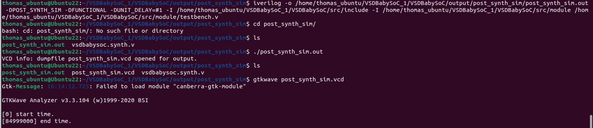 </div>
<div align="center">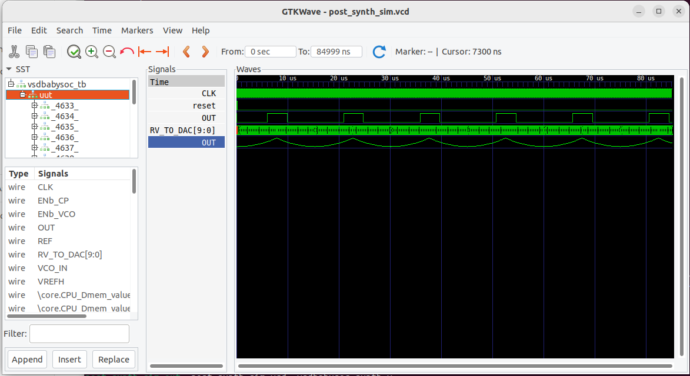 </div>
