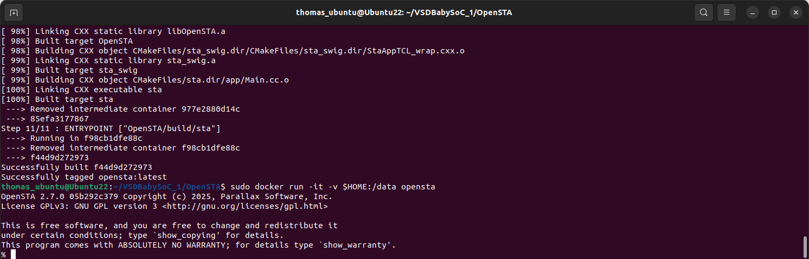

# Static Timing Analysis with OpenSTA
---

### 1. OpenSTA

OpenSTA is a open-source static timing analysis tool.

OpenSTA installed and accessed:

 

---
### 2. Using OpenSTA to do timing analysis
---

